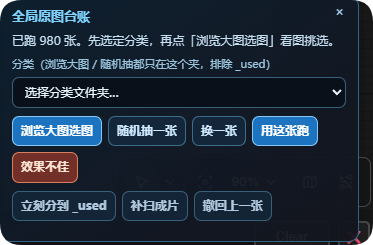

# ComfyUI Image Ledger（原图台账）

[English](README.md) · [安全策略](SECURITY.md) · [参与贡献](CONTRIBUTING.md)

ComfyUI Image Ledger 用来记录“哪些原图已经真正生成过最终视频”。它提供全局图库、随机无重复队列和成片后记账；普通工作流无需逐个添加自定义节点。

> 当前版本：公开测试版 `0.1.0`。默认开启记账，但**默认不移动任何原图**。



## 适合什么场景

- 有大量图生视频原图，不想重复跑同一张。
- 多个工作流共用一份完成记录。
- 想先在大图画廊里挑图，再自动写回 `LoadImage` 并排队。
- 只有最终视频确实保存成功后，才把原图算作完成。
- 需要按内容哈希去重、崩溃恢复、撤销、旧视频补录。

## 安装

把仓库克隆到 `ComfyUI/custom_nodes` 后重启 ComfyUI：

```bash
cd ComfyUI/custom_nodes
git clone https://github.com/Rona1do/ComfyUI-Image-Ledger.git
```

无需额外安装 Python 包。SQLite、Pillow 和 aiohttp 均由 ComfyUI 环境提供；旧视频补录会优先复用 VideoHelperSuite 或 `imageio-ffmpeg` 的 FFmpeg。

## 最快上手：全局模式

1. 把原图库放在 `ComfyUI/input/AI` 下，并用一级文件夹分类。
2. 重启后，右下角会显示“全局原图台账”。
3. 选择分类，然后浏览大图或随机抽取。
4. 点击“用这张跑”，脚本会写回最可能的源图 `LoadImage` 并 Queue。
5. 工作流成功保存最终视频后，这张图才会记为完成。

脚本会优先选择标题含 `source`、`first frame`、`源图`、`首帧` 的 `LoadImage`，并排除 `last frame`、`mask`、`末帧`、`遮罩`。只有一个启用中的 `LoadImage` 时会使用它作为兜底。

## 文件移动是可选功能

默认只记账，不移动文件。需要自动归档时，在以下位置明确开启：

`Settings → Image Ledger → Global tracking → Move source`

开启后，`input/AI/portraits/001.png` 会移动到 `input/AI/portraits/_used/001.png`。

“效果不佳 / Reject”会移动到 `_used/_rejected`。面板可以撤销最近一次操作。对重要图库开启前，建议先用少量备份文件验证。

## 高级模式：节点式精确记账

```text
Image Ledger · Visual Queue.image
    → 原图生视频流程
    → VHS_VideoCombine.Filenames
    → Image Ledger · Commit Finished Video.filenames

Image Ledger · Visual Queue.job_ticket
    → Image Ledger · Commit Finished Video.job_ticket
```

Commit 节点只有在最终视频位于 ComfyUI output、文件存在且非空时才提交完成状态。请把它放在最终视频保存节点之后、清理节点之前。

## 数据与隐私

运行数据不写进项目目录：

```text
ComfyUI/user/default/image_ledger/ledger.sqlite3
ComfyUI/user/default/image_ledger/settings.json
ComfyUI/user/default/image_ledger/thumbs/
```

可用 `COMFYUI_IMAGE_LEDGER_DIR` 改数据目录，用 `COMFYUI_IMAGE_LEDGER_FFMPEG` 指定 FFmpeg。

项目没有遥测、登录或云端上传。它只读取 ComfyUI input/output 范围内的文件，写本地 SQLite 与缩略图缓存，并在用户明确开启后移动源图。

## 已知限制

- 推荐 Python 3.10+ 和近期版本的 ComfyUI。
- 全局图库目前约定使用 `ComfyUI/input/AI`。
- 自动记账需要执行结果中出现成功保存的视频条目。
- 旧视频只有保留兼容的 prompt metadata 才能恢复原图。
- ComfyUI 内部执行接口可能变化；反馈兼容问题时请附 ComfyUI 版本或提交日期。

测试命令和提交流程见 [CONTRIBUTING.md](CONTRIBUTING.md)，后续计划见 [ROADMAP.md](ROADMAP.md)。

## 许可证

[MIT](LICENSE)。ComfyUI 是独立项目，本仓库不包含 ComfyUI 本体。
